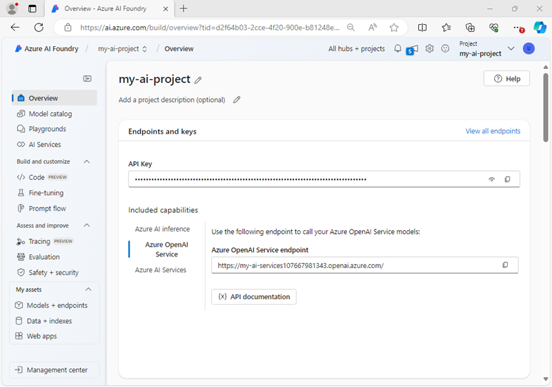

---
lab:
    title: 'Recognize and Synthesize Speech (Azure AI Foundry version)'
    module: 'Module 4 - Create speech-enabled apps with Azure AI services'
---

<!--
Possibly update to use standalone AI Service instead of Foundry?
-->

# Recognize and synthesize speech

**Azure AI Speech** is a service that provides speech-related functionality, including:

- A *speech-to-text* API that enables you to implement speech recognition (converting audible spoken words into text).
- A *text-to-speech* API that enables you to implement speech synthesis (converting text into audible speech).

In this exercise, you'll use both of these APIs to implement a speaking clock application.

> **NOTE**
> This exercise is designed to be completed in the Azure cloud shell, where direct access to your computer's sound hardware is not supported. The lab will therefore use audio files for speech input and output streams. The code to achieve the same results using a mic and speaker is provided for your reference.

## Create an Azure AI Foundry project

Let's start by creating an Azure AI Foundry project.

1. In a web browser, open the [Azure AI Foundry portal](https://ai.azure.com) at `https://ai.azure.com` and sign in using your Azure credentials. Close any tips or quick start panes that are opened the first time you sign in, and if necessary use the **Azure AI Foundry** logo at the top left to navigate to the home page, which looks similar to the following image:

    

1. In the home page, select **+ Create project**.
1. In the **Create a project** wizard, enter a valid name for your project, and if an existing hub is suggested, choose the option to create a new one. Then review the Azure resources that will be automatically created to support your hub and project.
1. Select **Customize** and specify the following settings for your hub:
    - **Hub name**: *A valid name for your hub*
    - **Subscription**: *Your Azure subscription*
    - **Resource group**: *Create or select a resource group*
    - **Location**: Choose any available region
    - **Connect Azure AI Services or Azure OpenAI**: *Create a new AI Services resource*
    - **Connect Azure AI Search**: *Create a new Azure AI Search resource with a unique name*

1. Select **Next** and review your configuration. Then select **Create** and wait for the process to complete.
1. When your project is created, close any tips that are displayed and review the project page in Azure AI Foundry portal, which should look similar to the following image:

    

## Prepare and configure the speaking clock app

1. In the Azure AI Foundry portal, view the **Overview** page for your project.
1. In the **Project details** area, note the **Project connection string** and **location** for your project You'll use the connection string to connect to your project in a client application, and you'll need the location to connect to the Azure AI Services Speech endpoint.
1. Open a new browser tab (keeping the Azure AI Foundry portal open in the existing tab). Then in the new tab, browse to the [Azure portal](https://portal.azure.com) at `https://portal.azure.com`; signing in with your Azure credentials if prompted.
1. Use the **[\>_]** button to the right of the search bar at the top of the page to create a new Cloud Shell in the Azure portal, selecting a ***PowerShell*** environment. The cloud shell provides a command line interface in a pane at the bottom of the Azure portal.

    > **Note**: If you have previously created a cloud shell that uses a *Bash* environment, switch it to ***PowerShell***.

1. In the cloud shell toolbar, in the **Settings** menu, select **Go to Classic version** (this is required to use the code editor).

    > **Tip**: As you paste commands into the cloudshell, the ouput may take up a large amount of the screen buffer. You can clear the screen by entering the `cls` command to make it easier to focus on each task.

1. In the PowerShell pane, enter the following commands to clone the GitHub repo for this exercise:

    ```
   rm -r mslearn-ai-language -f
   git clone https://github.com/microsoftlearning/mslearn-ai-language mslearn-ai-language
    ```

    ***Now follow the steps for your chosen programming language.***

1. After the repo has been cloned, navigate to the folder containing the speaking clock application code files:  

    **Python**

    ```
   cd mslearn-ai-language/labfiles/07b-speech/python/speaking-clock
    ```

    **C#**

    ```
   cd mslearn-ai-language/labfiles/07b-speech/c-sharp/speaking-clock
    ```

1. In the cloud shell command line pane, enter the following command to install the libraries you'll use:

    **Python**

    ```
   python -m venv labenv
   ./labenv/bin/Activate.ps1
   pip install python-dotenv azure-identity azure-ai-projects azure-cognitiveservices-speech==1.42.0
    ```

    **C#**

    ```
   dotnet add package Azure.Identity
   dotnet add package Azure.AI.Projects --prerelease
   dotnet add package Microsoft.CognitiveServices.Speech --version 1.42.0
    ```

1. Enter the following command to edit the configuration file that has been provided:

    **Python**

    ```
   code .env
    ```

    **C#**

    ```
   code appsettings.json
    ```

    The file is opened in a code editor.

1. In the code file, replace the **your_project_endpoint** and **your_location** placeholders with the connection string and location for your project (copied from the project **Overview** page in the Azure AI Foundry portal).
1. After you've replaced the placeholders, use the **CTRL+S** command to save your changes and then use the **CTRL+Q** command to close the code editor while keeping the cloud shell command line open.

## Add code to use the Azure AI Speech SDK

> **Tip**: As you add code, be sure to maintain the correct indentation.

1. Enter the following command to edit the code file that has been provided:

    **Python**

    ```
   code speaking-clock.py
    ```

    **C#**

    ```
   code Program.cs
    ```

1. At the top of the code file, under the existing namespace references, find the comment **Import namespaces**. Then, under this comment, add the following language-specific code to import the namespaces you will need to use the Azure AI Speech SDK with the Azure AI Services resource in your Azure Ai Foundry project:

    **Python**

    ```python
   # Import namespaces
   from dotenv import load_dotenv
   from azure.ai.projects.models import ConnectionType
   from azure.identity import DefaultAzureCredential
   from azure.core.credentials import AzureKeyCredential
   from azure.ai.projects import AIProjectClient
   import azure.cognitiveservices.speech as speech_sdk
    ```

    **C#**

    ```csharp
   // Import namespaces
   using Azure.Identity;
   using Azure.AI.Projects;
   using Microsoft.CognitiveServices.Speech;
   using Microsoft.CognitiveServices.Speech.Audio;
    ```

1. In the **main** function, under the comment **Get config settings**, note that the code loads the project connection string and location you defined in the configuration file.

1. Add the following code under the comment **Get AI Speech endpoint and key from the project**:

    **Python**

    ```python
   # Get AI Services key from the project
   project_client = AIProjectClient.from_connection_string(
        conn_str=project_connection,
        credential=DefaultAzureCredential())

   ai_svc_connection = project_client.connections.get_default(
      connection_type=ConnectionType.AZURE_AI_SERVICES,
      include_credentials=True, 
    )

   ai_svc_key = ai_svc_connection.key

    ```

    **C#**

    ```csharp
   // Get AI Services key from the project
   var projectClient = new AIProjectClient(project_connection,
                        new DefaultAzureCredential());

   ConnectionResponse aiSvcConnection = projectClient.GetConnectionsClient().GetDefaultConnection(ConnectionType.AzureAIServices, true);

   var apiKeyAuthProperties = aiSvcConnection.Properties as ConnectionPropertiesApiKeyAuth;

   var aiSvcKey = apiKeyAuthProperties.Credentials.Key;
    ```

    This code connects to your Azure AI Foundry project, gets its default AI Services connected resource, and retrieves the authentication key needed to use it.

1. Under the comment **Configure speech service**, add the following code to use the AI Services key and your project's region to configure your connection to the Azure AI Services Speech endpoint

   **Python**

    ```python
   # Configure speech service
   speech_config = speech_sdk.SpeechConfig(ai_svc_key, location)
   print('Ready to use speech service in:', speech_config.region)
    ```

    **C#**

    ```csharp
   // Configure speech service
   speechConfig = SpeechConfig.FromSubscription(aiSvcKey, location);
   Console.WriteLine("Ready to use speech service in " + speechConfig.Region);
    ```

1. Save your changes (*CTRL+S*), but leave the code editor open.

## Run the app

So far, the app doesn't do anything other than connect to your Azure AI Foundry project to retrieve the details needed to use the Speech service, but it's useful to run it and check that it works before adding speech functionality.

1. In the command line below the code editor, enter the following Azure CLI command to determine the Azure account that is signed in for the session:

    ```
   az account show
    ```

    The resulting JSON output should include details of your Azure account and the subscription you are working in (which should be the same subscription in which you created your Azure AI Foundry project.)

    Your app uses the Azure credentials for the context in which it's run to authenticate the connection to your project. In a production environment the app might be configured to run using a managed identity. In this development environment, it will use your authenticated cloud shell session credentials.

    > **Note**: You can sign into Azure in your development environment by using the `az login` Azure CLI command. In this case, the cloud shell has already logged in using the Azure credentials you signed into the portal with; so signing in explicitly is unnecessary. To learn more about using the Azure CLI to authenticate to Azure, see [Authenticate to Azure using Azure CLI](https://learn.microsoft.com/cli/azure/authenticate-azure-cli).

1. In the command line, enter the following language-specific command to run the speaking clock app:

    **Python**

    ```
   python speaking-clock.py
    ```

    **C#**

    ```
   dotnet run
    ```

1. If you are using C#, you can ignore any warnings about using the **await** operator in asynchronous methods - we'll fix that later. The code should display the region of the speech service resource the application will use. A successful run indicates that the app has connected to your Azure AI Foundry project and retrieved the key it needs to use the Azure AI Speech service.

## Add code to recognize speech

Now that you have a **SpeechConfig** for the speech service in your project's Azure AI Services resource, you can use the **Speech-to-text** API to recognize speech and transcribe it to text.

In this procedure, the speech input is captured from an audio file, which you can play here:

<video controls src="ai-foundry/media/Time.mp4" title="What time is it?" width="150"></video>

1. In the **Main** function, note that the code uses the **TranscribeCommand** function to accept spoken input. Then in the **TranscribeCommand** function, under the comment **Configure speech recognition**, add the appropriate code below to create a **SpeechRecognizer** client that can be used to recognize and transcribe speech from an audio file:

    **Python**

    ```python
   # Configure speech recognition
   current_dir = os.getcwd()
   audioFile = current_dir + '/time.wav'
   audio_config = speech_sdk.AudioConfig(filename=audioFile)
   speech_recognizer = speech_sdk.SpeechRecognizer(speech_config, audio_config)
    ```

    **C#**

    ```csharp
   // Configure speech recognition
   string audioFile = "time.wav";
   using AudioConfig audioConfig = AudioConfig.FromWavFileInput(audioFile);
   using SpeechRecognizer speechRecognizer = new SpeechRecognizer(speechConfig, audioConfig);
    ```

1. In the **TranscribeCommand** function, under the comment **Process speech input**, add the following code to listen for spoken input, being careful not to replace the code at the end of the function that returns the command:

    **Python**

    ```python
   # Process speech input
   print("Listening...")
   speech = speech_recognizer.recognize_once_async().get()
   if speech.reason == speech_sdk.ResultReason.RecognizedSpeech:
       command = speech.text
       print(command)
   else:
       print(speech.reason)
       if speech.reason == speech_sdk.ResultReason.Canceled:
           cancellation = speech.cancellation_details
           print(cancellation.reason)
           print(cancellation.error_details)
    ```

    **C#**

    ```csharp
   // Process speech input
   Console.WriteLine("Listening...");
   SpeechRecognitionResult speech = await speechRecognizer.RecognizeOnceAsync();
   if (speech.Reason == ResultReason.RecognizedSpeech)
   {
       command = speech.Text;
       Console.WriteLine(command);
   }
   else
   {
       Console.WriteLine(speech.Reason);
       if (speech.Reason == ResultReason.Canceled)
       {
           var cancellation = CancellationDetails.FromResult(speech);
           Console.WriteLine(cancellation.Reason);
           Console.WriteLine(cancellation.ErrorDetails);
       }
   }
    ```

1. Save your changes (*CTRL+S*), and then in the command line below the code editor, enter the following command to run the program:

    **Python**

    ```
   python speaking-clock.py
    ```

    **C#**

    ```
   dotnet run
    ```

1. Review the output from the application, which should successfully "hear" the speech in the audio file and return an appropriate response (note that your Azure cloud shell may be running on a server that is in a different time-zone to yours!)

    > **Tip**: If the SpeechRecognizer encounters an error, it produces a result of "Cancelled". The code in the application will then display the error message. The most likely cause is an incorrect region value in the configuration file.

## Synthesize speech

Your speaking clock application accepts spoken input, but it doesn't actually speak! Let's fix that by adding code to synthesize speech.

Once again, due to the hardware limitations of the cloud shell we'll direct the synthesized speech output to a file.

1. In the **Main** function for your program, note that the code uses the **TellTime** function to tell the user the current time.
1. In the **TellTime** function, under the comment **Configure speech synthesis**, add the following code to create a **SpeechSynthesizer** client that can be used to generate spoken output:

    **Python**

    ```python
   # Configure speech synthesis
   output_file = "output.wav"
   speech_config.speech_synthesis_voice_name = "en-GB-RyanNeural"
   audio_config = speech_sdk.audio.AudioConfig(filename=output_file)
   speech_synthesizer = speech_sdk.SpeechSynthesizer(speech_config, audio_config,)
    ```

    **C#**

    ```csharp
   // Configure speech synthesis
   var outputFile = "output.wav";
   speechConfig.SpeechSynthesisVoiceName = "en-GB-RyanNeural";
   using var audioConfig = AudioConfig.FromWavFileOutput(outputFile);
   using SpeechSynthesizer speechSynthesizer = new SpeechSynthesizer(speechConfig, audioConfig);
    ```

1. In the **TellTime** function, under the comment **Synthesize spoken output**, add the following code to generate spoken output, being careful not to replace the code at the end of the function that prints the response:

    **Python**

    ```python
   # Synthesize spoken output
   speak = speech_synthesizer.speak_text_async(response_text).get()
   if speak.reason != speech_sdk.ResultReason.SynthesizingAudioCompleted:
       print(speak.reason)
   else:
       print("Spoken output saved in " + outputFile)
    ```

    **C#**

    ```csharp
   // Synthesize spoken output
   SpeechSynthesisResult speak = await speechSynthesizer.SpeakTextAsync(responseText);
   if (speak.Reason != ResultReason.SynthesizingAudioCompleted)
   {
       Console.WriteLine(speak.Reason);
   }
   else
   {
       Console.WriteLine("Spoken output saved in " + outputFile);
   }
    ```

1. Save your changes (*CTRL+S*), and then in the command line below the code editor, enter the following command to run the program:

   **Python**

    ```
   python speaking-clock.py
    ```

    **C#**

    ```
   dotnet run
    ```

1. Review the output from the application, which should indicate that the spoken output was saved in a file.
1. If you have a media player capable of playing .wav audio files, in the toolbar for the cloud shell pane, use the **Upload/Download files** button to download the audio file from your app folder, and then play it:

    **Python**

    /home/*user*`/mslearn-ai-language/Labfiles/07b-speech/Python/speaking-clock/output.wav`

    **C#**

    /home/*user*`/mslearn-ai-language/Labfiles/07b-speech/C-Sharp/speaking-clock/output.wav`

    The file should sound similar to this:

    <video controls src="./ai-foundry/media/Output.mp4" title="The time is 2:15" width="150"></video>

## Use Speech Synthesis Markup Language

Speech Synthesis Markup Language (SSML) enables you to customize the way your speech is synthesized using an XML-based format.

1. In the **TellTime** function, replace all of the current code under the comment **Synthesize spoken output** with the following code (leave the code under the comment **Print the response**):

    **Python**

    ```python
   # Synthesize spoken output
   responseSsml = " \
       <speak version='1.0' xmlns='http://www.w3.org/2001/10/synthesis' xml:lang='en-US'> \
           <voice name='en-GB-LibbyNeural'> \
               {} \
               <break strength='weak'/> \
               Time to end this lab! \
           </voice> \
       </speak>".format(response_text)
   speak = speech_synthesizer.speak_ssml_async(responseSsml).get()
   if speak.reason != speech_sdk.ResultReason.SynthesizingAudioCompleted:
       print(speak.reason)
   else:
       print("Spoken output saved in " + outputFile)
    ```

   **C#**

    ```csharp
   // Synthesize spoken output
   string responseSsml = $@"
       <speak version='1.0' xmlns='http://www.w3.org/2001/10/synthesis' xml:lang='en-US'>
           <voice name='en-GB-LibbyNeural'>
               {responseText}
               <break strength='weak'/>
               Time to end this lab!
           </voice>
       </speak>";
   SpeechSynthesisResult speak = await speechSynthesizer.SpeakSsmlAsync(responseSsml);
   if (speak.Reason != ResultReason.SynthesizingAudioCompleted)
   {
       Console.WriteLine(speak.Reason);
   }
   else
   {
        Console.WriteLine("Spoken output saved in " + outputFile);
   }
    ```

1. Save your changes and return to the integrated terminal for the **speaking-clock** folder, and enter the following command to run the program:

    **Python**

    ```
   python speaking-clock.py
    ```

    **C#**

    ```
   dotnet run
    ```

1. Review the output from the application, which should indicate that the spoken output was saved in a file.
1. Once again, if you have a media player capable of playing .wav audio files, in the toolbar for the cloud shell pane, use the **Upload/Download files** button to download the audio file from your app folder, and then play it:

    **Python**

    /home/*user*`/mslearn-ai-language/Labfiles/07b-speech/Python/speaking-clock/output.wav`

    **C#**

    /home/*user*`/mslearn-ai-language/Labfiles/07b-speech/C-Sharp/speaking-clock/output.wav`

    The file should sound similar to this:
    
    <video controls src="./ai-foundry/media/Output2.mp4" title="The time is 5:30. Time to end this lab." width="150"></video>

## Clean up

If you've finished exploring Azure AI Speech, you should delete the resources you have created in this exercise to avoid incurring unnecessary Azure costs.

1. Return to the browser tab containing the Azure portal (or re-open the [Azure portal](https://portal.azure.com) at `https://portal.azure.com` in a new browser tab) and view the contents of the resource group where you deployed the resources used in this exercise.
1. On the toolbar, select **Delete resource group**.
1. Enter the resource group name and confirm that you want to delete it.

## What if you have a mic and speaker?

In this exercise, you used audio files for the speech input and output. Let's see how the code can be modified to use audio hardware.

### Using speech recognition with a microphone

If you have a mic, you can use the following code to capture spoken input for speech recognition:

**Python**

```python
# Configure speech recognition
audio_config = speech_sdk.AudioConfig(use_default_microphone=True)
speech_recognizer = speech_sdk.SpeechRecognizer(speech_config, audio_config)
print('Speak now...')

# Process speech input
speech = speech_recognizer.recognize_once_async().get()
if speech.reason == speech_sdk.ResultReason.RecognizedSpeech:
    command = speech.text
    print(command)
else:
    print(speech.reason)
    if speech.reason == speech_sdk.ResultReason.Canceled:
        cancellation = speech.cancellation_details
        print(cancellation.reason)
        print(cancellation.error_details)

```

**C#**

```csharp
// Configure speech recognition
using AudioConfig audioConfig = AudioConfig.FromDefaultMicrophoneInput();
using SpeechRecognizer speechRecognizer = new SpeechRecognizer(speechConfig, audioConfig);
Console.WriteLine("Speak now...");

SpeechRecognitionResult speech = await speechRecognizer.RecognizeOnceAsync();
if (speech.Reason == ResultReason.RecognizedSpeech)
{
    command = speech.Text;
    Console.WriteLine(command);
}
else
{
    Console.WriteLine(speech.Reason);
    if (speech.Reason == ResultReason.Canceled)
    {
        var cancellation = CancellationDetails.FromResult(speech);
        Console.WriteLine(cancellation.Reason);
        Console.WriteLine(cancellation.ErrorDetails);
    }
}
```

> **Note**: The system default microphone is the default audio input, so you could also just omit the AudioConfig altogether!

### Using speech synthesis with a speaker

If you have a speaker, you can use the following code to synthesize speech.

**Python**

```python
response_text = 'The time is {}:{:02d}'.format(now.hour,now.minute)

# Configure speech synthesis
speech_config.speech_synthesis_voice_name = "en-GB-RyanNeural"
audio_config = speech_sdk.audio.AudioOutputConfig(use_default_speaker=True)
speech_synthesizer = speech_sdk.SpeechSynthesizer(speech_config, audio_config)

# Synthesize spoken output
speak = speech_synthesizer.speak_text_async(response_text).get()
if speak.reason != speech_sdk.ResultReason.SynthesizingAudioCompleted:
    print(speak.reason)
```

**C#**

```csharp
var now = DateTime.Now;
string responseText = "The time is " + now.Hour.ToString() + ":" + now.Minute.ToString("D2");

// Configure speech synthesis
speechConfig.SpeechSynthesisVoiceName = "en-GB-RyanNeural";
using var audioConfig = AudioConfig.FromDefaultSpeakerOutput();
using SpeechSynthesizer speechSynthesizer = new SpeechSynthesizer(speechConfig, audioConfig);

// Synthesize spoken output
SpeechSynthesisResult speak = await speechSynthesizer.SpeakTextAsync(responseText);
if (speak.Reason != ResultReason.SynthesizingAudioCompleted)
{
    Console.WriteLine(speak.Reason);
}
```

> **Note**: The system default speaker is the default audio output, so you could also just omit the AudioConfig altogether!

## More information

For more information about using the **Speech-to-text** and **Text-to-speech** APIs, see the [Speech-to-text documentation](https://learn.microsoft.com/azure/ai-services/speech-service/index-speech-to-text) and [Text-to-speech documentation](https://learn.microsoft.com/azure/ai-services/speech-service/index-text-to-speech).
