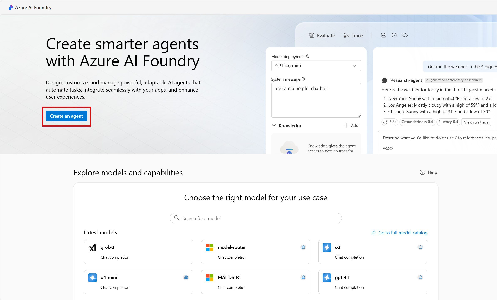
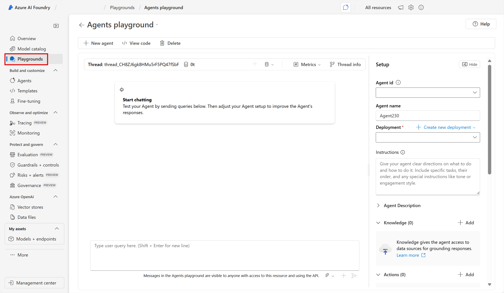
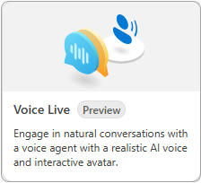

---
lab:
    title: 'Explore the Voice Live API'
    description: 'Learn how to use, and customize, the Voice Live API available in the Azure AI Foundry Playground.'
---

# Explore the Voice Live API

In this exercise you create an agent in the Azure AI Foundry and explore the Voice Live API in the Speech Playground. 

This exercise takes approximately **30** minutes to complete.

> <span style="color:red">**Note**:</span> Some of the technologies used in this exercise are currently in preview or in active development. You may experience some unexpected behavior, warnings, or errors.

> <span style="color:red">**Note**:</span> This exercise is designed to be completed in a browser environment with direct access to your computer's microphone. While the concepts can be explored in Azure Cloud Shell, the interactive voice features require local audio hardware access.

## Create an Azure AI Foundry project

Let's start by creating an Azure AI Foundry project.

1. In a web browser, open the [Azure AI Foundry portal](https://ai.azure.com) at `https://ai.azure.com` and sign in using your Azure credentials. Close any tips or quick start panes that are opened the first time you sign in, and if necessary use the **Azure AI Foundry** logo at the top left to navigate to the home page, which looks similar to the following image (close the **Help** pane if it's open):

    

1. In the home page, select **Create an agent**.

1. In the **Create an agent** wizard, enter a valid name for your project. 

1. Select **Advanced options** and specify the following settings:
    - **Azure AI Foundry resource**: *Keep the default name*
    - **Subscription**: *Your Azure subscription*
    - **Resource group**: *Create or select a resource group*
    - **Region**: Randomly select a region from the following options:\*
        - East US 2
        - Sweden Central

    > \* At the time of writing, the Voice Live API is only supported in the previously listed regions. Selecting a location randomly helps ensure a single region isn't overwhelmed with traffic, and helps you have a smoother experience. In the event of service limits being reached, there's a possibility you may need to create another project in a different region.

1. Select **Create** and review your configuration. Wait for the set up process to complete.

    >**Note**: If you receive a permissions error, select the **Fix it** button to add the appropriate permissions to continue.

1. When your project is created, you will be brought by default to the Agents playground in Azure AI Foundry portal, which should look similar to the following image:

    

## Start a Voice Live sample

 In this section of the exercise you interact with one of the agents. 

1. Select **Playgrounds** in the navigation pane.

1. Locate the **Speech playground** group, and select the **Try the Speech playground** button.

1. The Speech Playground offers many pre-built options. Use the horizontal scroll bar to navigate to the end of the list and select the **Voice Live** tile. 

    

1. Select the **Casual chat** agent sample in **Try with samples** panel.

1. Ensure your microphone and speakers are working and select the **Start** button at the bottom of the page. 

    As you interact with the agent, notice you can interrupt the agent and it will pause to listen. Try speaking with different lengths of pauses between words and sentences. Notice how quickly the agent recognizes the pauses and fills in the conversation. When you're finished select the **End** button.

1. Start the other sample agents to explore how they behave.

    As you explore the different agents note the changes in the  **Response instruction** section in the **Configuration** panel.

## Configure the agent 

In this section you change the voice of the agent, and add an avatar to the **Casual chat** agent. The **Configuration** panel is divided into three sections: **GenAI**, **Speech**, and **Avatar**.

>**Note:** If you change, or interact with, any of the configuration options you need to select the **Apply** button at the bottom of the **Configuration** panel to enable the agent.

Select the **Casual chat** agent. Next, change the voice of the agent, and add an avatar, with the following instructions:

1. Select **> Speech** to expand the section and access the options.

1. Select the drop-down menu in the **Voice** option and choose a different voice.

1. Select **Apply** to save your changes, and then **Start** to launch the agent and hear your change.

    Repeat the previous steps to try a few different voices. Proceed to the next step when you're finished with the voice selection.

1. Select **> Avatar** to expand the section and access the options.

1. Select the toggle button to enable the feature and select one of the avatars. 

1. Select **Apply** to save your changes, and then **Start** to launch the agent. 

    Notice the avatar's animation and synchronization to the audio.

1. Expand the **> GenAI** section and set the **Proactive engagement** toggle to the off position. Next, select **Apply** to save your changes, and then **Start** to launch the agent.

    With the **Proactive engagement** turned off, the agent doesn't initiate the conversation. Ask the agent "Can you tell me what you do?" to start the conversation.

>**Tip:** You can select **Reset to default** and then **Apply** to return the agent to its default behavior.

When you're finished, proceed to the next section.

## Create a voice agent

In this section you create your own voice agent from scratch.

1. Select **Start from blank** in the **Try with your own** section of the panel. 

1. Expand the **> GenAI** section of the **Configuration** panel.

1. Select the **Generative AI model** drop-down menu and choose the **GPT-4o Mini Realtime** model.

1. Add the following text in the **Response instruction** section.

    ```
    You are a voice agent named "Ava" who acts as a friendly car rental agent. 
    ```

1. Set the **Response temperature** slider to a value of **0.8**. 

1. Set the **Proactive engagement** toggle to the on position.

1. Select **Apply** to save your changes, and then **Start** to launch the agent.

    The agent will introduce itself and ask how it can help you today. Ask the agent "Do you have any sedans available for rent on Thursday?" Notice how long it takes the agent to respond. Ask the agent other questions to see how it responds. When you're finished, proceed to the next step.

1. Expand the **> Speech** section of the **Configuration** panel.

1. Set the **End of utterance (EOU)** toggle button to the **on** position.

1. Set the **Audio enhancement** toggle button to the **on** position.

1. Select **Apply** to save your changes, and then **Start** to launch the agent.

    After the agent introduces itself, ask it "Do you have any planes for rent?" Notice the agent responds more quickly than it did earlier after finishing your question. The **End of utterance (EOU)** setting configures the agent to detect pauses and your end of speech based on context and semantics. This enables it to have a more natural conversation.

When you're finished, proceed to the next section.

## Clean up resources

Now that you finished the exercise, delete the project you created to avoid unnecessary resource usage.

1. Select **Management center** in the AI Foundry navigation menu.
1. Select **Delete project** in the right information pane, and then confirm the deletion.

